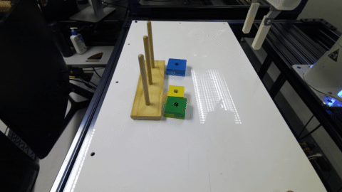

## IAM Lab Multi-Task Pick and Insert Dataset

The dataset contains ~650 episodes (~150K steps) for two different skills Pick and Insert. The pick skill is instantiated with a small set of objects with varying shapes and sizes. The insert skill is used on a single object. The object set used for data collection is the [Melissa & Doug Geometric Stacker - Wooden Educational Toy](https://a.co/d/3tTWwH4) and can be bought from Amazon for under 20$.

The dataset contains multiple camera views - one for a statically mounted third-person view and another wrist-mounted first-preson view. We use two different third-person views for data collection. All image data was recorded at 20Hz. The propriocetive data was recorded at 75Hz, but is subsampled for this dataset release to be at 20Hz and timestep aligned with the image data.

The original dataset in both TFRecord and simple hdf5 format is also available at the following google drive link: https://drive.google.com/drive/folders/11hf-IF9bmqd39vWPt4By_Wi0HPTYMZjg?usp=drive_link.

---

Below are some example videos from the dataset.

**Instruction**: Pick and insert green block.

 

**Instruction**: Pick blue block

 